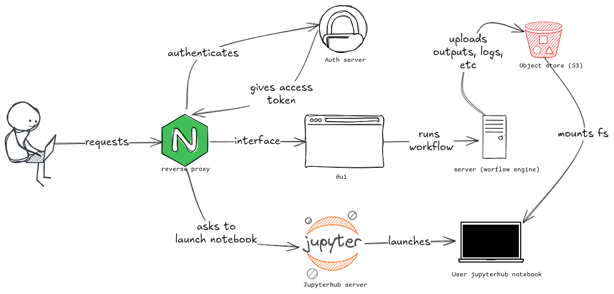

# jupyter_s3fs

This is a `POC` for system integration of JupyterHub with MinIO object storage
using [FUSE](https://docs.kernel.org/filesystems/fuse.html) (Filesystem
in Userspace) mounting. The application allows users to interact with files
via a GUI (analogous to a `dashboard` aka `platform`), passing them to server
(analagous to a `workflow engine`), which uploads them to MinIO buckets. These
files can then be mounted onto Jupyter notebook instances, allowing users to 
interact with them as if it were a local filesystem.



For more details, take a look at docs of [s3fs](https://github.com/s3fs-fuse/s3fs-fuse).

## Installation

### Pre-requisites

- `docker`
- `docker compose`

### Steps

1.Clone the repository

```bash
git clone https://github.com/JaeAeich/jupyter_s3fs
```

2.Change directory

```bash
cd jupyter_s3fs
```

3.Start the services

```bash
docker-compose up --build -d
```

To access the dashboard, open your browser and navigate to [localhost](http://localhost).
Once there, you can upload any files you'd like to work with, and these will
be available for you in the Jupyter Notebook. To launch the notebook, click the
button in the top-right corner. As the authentication server is not yet
implemented, you can use any credentials — I recommend using your name as both
the username and password (you can later can check notebook's persistense this way).
After logging in, you’ll be able to see the files you uploaded, using
`file handling` in the language of your choice at the default mount point `/mnt/s3buckets`.

Below is example python code to do so:

```python
import os
path = '/mnt/s3buckets'
files = os.listdir(path)
# Print the files
for file in files:
  print(file)
```
